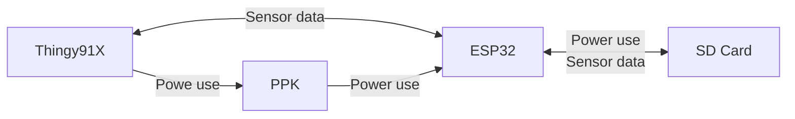
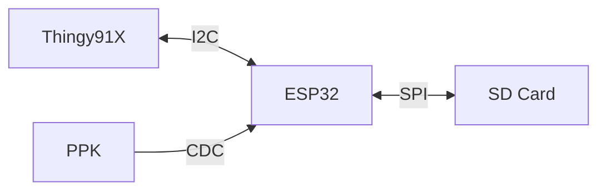

# Local Data Storage

## Use case:
To provide more storagespace for Thingy91x in order to store readings for when field tested.
 
Data that will be stored is mainly:
- PPK data for an overview of power consumption
- Location data/sensor data

## Function

### Data Flow

### Protocols

## Files
- Main.cpp: main run file 
- Config.h is for defining constant variables for ease of change
- sdcard.h: sdcard read/write function
- ppk_reader.h: interprate ppk data