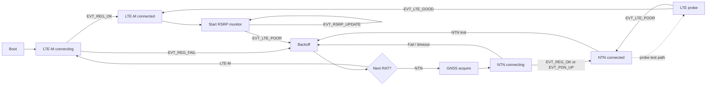

<div align="center">
  <h1>IES2608 Asset Tracker</h1>
  <p>Prototype firmware for testing dynamic LTE-M / NTN fallback on Nordic cellular hardware.</p>
  <p>
    <a href="https://www.nordicsemi.com/Products/Development-software/nRF-Connect-SDK"></a>
    <a href="https://www.zephyrproject.org/"></a>
    <a href="https://en.cppreference.com/w/c/language"></a>
    <a href="https://www.nordicsemi.com/Products/nRF9151"></a>
    <a href="https://www.nordicsemi.com/Products/Development-hardware/Nordic-Thingy-91-X"></a>
    <a href="/LICENSE"></a>
  </p>
  <p>
    <a href="#overview">Overview</a> |
    <a href="#current-code">Current code</a> |
    <a href="#state-flow">State flow</a> |
    <a href="#rsrp-and-motion">RSRP and motion</a> |
    <a href="#build-and-flash">Build and flash</a> |
    <a href="#project-structure">Project structure</a>
  </p>
</div>

## Overview

This repository contains an asset-tracker testbench for exploring when a device should stay on LTE-M and when it should fall back toward NTN. The current direction is Thingy:91 X on the nRF9151 non-secure target, with onboard sensors used to make the LTE signal checks more context-aware.

The active firmware application lives in `app/`. Other top-level folders contain documentation, helper material, earlier firmware/reference work, or tests.

Current app version: `0.5.0-dev`

## Repository status

This is prototype firmware for field testing, not production firmware. The main focus right now is validating LTE-M loss detection, NTN fallback flow, LTE recovery probing, and sensor-assisted RSRP polling behavior.

## Current code

| Area | Current behavior |
| --- | --- |
| Core app | Uses Zephyr SMF for the main application state machine and zbus for app events and sensor sample channels |
| LTE-M | Connects asynchronously through LTE Link Control and publishes registration events into the app state machine |
| RSRP monitor | Reads LTE RSRP through `AT+CESQ`, publishes RSRP updates, and emits `EVT_LTE_POOR` when LTE looks weak, worsening, or unavailable |
| Motion-aware polling | Uses the BMI270 accelerometer to poll RSRP faster while moving and slower while still |
| NTN | Contains the NTN connect path and switches the modem to NTN system mode when LTE fallback is requested |
| LTE probe | Experimental recovery path that switches back to TN, samples RSRP, and decides whether LTE is good enough to return |
| GNSS | GNSS state hooks are present for NTN-related flow decisions and location handoff |
| Cloud/location | nRF Cloud and cellular location modules are present, but the current field-test focus is the RAT switching path |
| Sensors | Accelerometer, battery, and environmental sensor demos are active on Thingy:91 X and publish zbus samples |
| nRF9151 DK | Supported as a secondary build target with the Thingy-only sensor demos disabled |

## State flow



## RSRP and motion

The RSRP service has two modes:

| Mode | Purpose |
| --- | --- |
| Monitor | Runs while LTE-M is connected and decides whether LTE is becoming poor enough to request NTN fallback |
| Probe | Experimental NTN recovery check that samples LTE RSRP after switching modem access back to TN |

The monitor publishes `EVT_LTE_POOR` when one of these conditions is reached:

| Condition | Current config |
| --- | --- |
| RSRP is at or below fallback threshold and drops sharply | `CONFIG_APP_MODEM_RSRP_FALLBACK_DBM=-105`, `CONFIG_APP_MODEM_RSRP_DROP_DB=5` |
| RSRP is at or below fallback threshold for several samples | `CONFIG_APP_MODEM_RSRP_WEAK_SAMPLE_COUNT=3` |
| RSRP trend worsens over the latest samples | Internal history length is `6`, trend check uses the latest `3` samples |
| RSRP is unknown or unavailable for several samples | `CONFIG_APP_MODEM_RSRP_LOSS_SAMPLE_COUNT=3` |

Motion changes how often the monitor runs:

| Asset state | Poll interval |
| --- | --- |
| Moving | `CONFIG_APP_MODEM_SIGNAL_POLL_INTERVAL_SEC=5` |
| Still or unknown | `CONFIG_APP_MODEM_SIGNAL_POLL_INTERVAL_STILL_SEC=30` |

The accelerometer keeps the device in the moving state for `CONFIG_APP_SENSOR_ACCEL_MOVING_HOLD_MS=60000` after recent movement. This is meant to handle smooth vehicle movement where acceleration may briefly become quiet even though the asset is still moving.

## Sensors

The Thingy:91 X sensor modules are simple demos that log to serial and publish zbus samples for later app integration.

| Module | Hardware | Output |
| --- | --- | --- |
| `accel.c` | BMI270 accelerometer | Movement state, speed estimate, linear acceleration, quiet time, raw xyz, linear xyz |
| `batt.c` | nPM1300 charger/gauge | Voltage, current, battery temperature, charger state, charger error, USB/VBUS presence |
| `temp.c` | BME680 environmental sensor | Temperature, pressure, humidity, gas resistance |
| `gyro.c` | Not active yet | Placeholder for future gyroscope work |

Sensor zbus channels are defined in `app/src/modules/common/app_zbus.*`:

| Channel | Message type |
| --- | --- |
| `gnss_status_chan` | `struct app_gnss_status` |
| `accel_sample_chan` | `struct app_accel_sample` |
| `battery_sample_chan` | `struct app_battery_sample` |
| `environment_sample_chan` | `struct app_environment_sample` |

## Configuration

Important configuration lives in `app/Kconfig`, `app/prj.conf`, and `app/boards/`.

| Config | Current role |
| --- | --- |
| `CONFIG_APP_SENSOR_ACCEL_DEMO` | Builds the accelerometer module when enabled |
| `CONFIG_APP_SENSOR_BATT_DEMO` | Builds the battery/charger module when enabled |
| `CONFIG_APP_SENSOR_TEMP_DEMO` | Builds the environmental sensor module when enabled |
| `CONFIG_APP_CORE_SEND_UDP_DATA` | Enables the UDP send test in the NTN/LTE probe flow |
| `CONFIG_APP_CORE_SM_PROBE_TEST` | Enables the dry-run timer path into LTE probe testing |
| `CONFIG_APP_DEBUG_*` | Optional debug stops or extra modem logging |

Board-specific behavior:

| Board config | Current sensor behavior |
| --- | --- |
| `app/boards/thingy91x_nrf9151_ns.conf` | Enables accelerometer and battery demos; temperature demo is enabled by the Thingy:91 X Kconfig default |
| `app/boards/thingy91x_nrf9151_ns.overlay` | Enables BMI270 accelerometer and BME680 environmental sensor nodes |
| `app/boards/nrf9151dk_nrf9151_ns.conf` | Disables accelerometer and battery demos because the DK does not have the same onboard sensors |

## Tech stack

- nRF Connect SDK `v3.2.4`
- Zephyr RTOS
- C firmware modules
- Zephyr SMF state machine
- Zephyr zbus messaging
- nRF modem library
- LTE Link Control
- Nordic NTN support
- Zephyr sensor drivers for Thingy:91 X sensors

## Build and flash

### Prerequisites

- nRF Connect SDK environment
- Nordic toolchain and `west`
- Nordic programmer tools / `nrfutil`
- Thingy:91 X or nRF9151 DK
- Serial terminal such as Tera Term

### Build for Thingy:91 X

```sh
west build -b thingy91x/nrf9151/ns app -d app/build_91x --pristine=always
```

### Build for nRF9151 DK

```sh
west build -b nrf9151dk/nrf9151/ns app -d app/build_9151 --pristine=always
```

The nRF9151 DK build disables the Thingy-only sensor demos through the board config.

### Flash with a debug probe

```sh
west flash -d app/build_91x
```

Use the matching build directory for the board you built.

### Flash Thingy:91 X directly over USB

For the Thingy:91 X USB DFU flow, the build should produce a DFU zip in the build directory.

1. List devices:

```sh
nrfutil device list
```

2. Program the nRF91 application core:

```sh
nrfutil device program --firmware app/build_91x/dfu_application.zip --serial-number <THINGY91X_SERIAL> --traits mcuboot --x-family nrf91 --core Application
```

Close any open serial terminal before programming over USB.

## Serial logs

Use the Thingy:91 X USB serial connection for app logs.

- Serial settings: `115200`, `8-N-1`
- If two USB serial ports appear, try both; one may be quiet depending on the USB bridge route
- Reset the board after flashing and check that the boot log shows the expected firmware version

Useful logs to watch during field testing:

| Log area | What to look for |
| --- | --- |
| Boot | `Firmware version: 0.5.0-dev` |
| LTE | Registration status and `LTE-M connected` state logs |
| RSRP | `LTE-M RSRP: ...`, `LTE-M RSRP dropped ...`, `LTE-M RSRP weak ...`, or `LTE-M RSRP unavailable ...` |
| Motion | `Motion state: moving`, `Motion state: still`, and movement detection logs |
| NTN | NTN registration, PDN up/down, and modem switch logs |
| LTE probe | Probe RSRP samples, average RSRP, and `EVT_LTE_GOOD` / `EVT_LTE_POOR` decisions |
| Sensors | Battery and environmental sample logs |

## Active application layout

```text
app/
  boards/                  Board-specific config and Thingy:91 X sensor overlay
  src/
    main.c                 Firmware entry point
    modules/
      cloud/               nRF Cloud connection wrapper
      common/              Shared events, app types, and zbus helpers
      core/                SMF application state machine
      gnss/                GNSS service hooks
      location/            LTE cellular location service wrapper
      lte/                 LTE-M connection service
      modem/               Modem mode switching and UDP test helper
      ntn/                 NTN connection service
      rsrp/                LTE signal monitor and LTE recovery probe
      sensors/             Thingy:91 X sensor demos
  CMakeLists.txt           App source selection
  Kconfig                  App configuration options
  prj.conf                 Default app configuration
  VERSION                  Firmware version
```

## Project structure

```text
app/        Active firmware application
docs/       Architecture notes, modem commands, diagrams, and west setup notes
Firmware/   Earlier firmware/reference material
scripts/    Helper scripts and script notes
tests/      Test and scratch work
west.yml    Workspace manifest
```

## Field-test focus

The current code is most useful for these tests:

1. Verify that RSRP logging changes between moving and still states.
2. Drive from good LTE-M coverage toward weak or lost LTE-M coverage.
3. Confirm whether `EVT_LTE_POOR` is triggered by weak signal, sharp drop, worsening trend, or unavailable RSRP.
4. Confirm that the state machine leaves LTE-M, enters backoff, and attempts the NTN path.
5. If probe testing is enabled, confirm whether LTE recovery probe publishes `EVT_LTE_GOOD` or `EVT_LTE_POOR`.

## Known prototype limits

- LTE probe is still experimental and disabled by default through `CONFIG_APP_CORE_SM_PROBE_TEST=n`.
- Sensor modules are demos; they publish useful data but are not yet power-optimized.
- RSRP thresholds are configurable but still need real field data before they should be treated as final.
- The project currently prioritizes observability and field-test behavior over production cleanup.

## Acknowledgements

This project uses the nRF Connect Asset Tracker Template as a reference:

[nrfconnect/Asset-Tracker-Template](https://github.com/nrfconnect/Asset-Tracker-Template/tree/main)

## License

This repository currently carries the Nordic Semiconductor 5-Clause license in [LICENSE](LICENSE).
