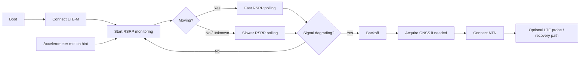

<div align="center">
  <h1>IES2608 Asset Tracker</h1>
  <p>Prototype firmware for dynamic LTE-M / NTN switching on Nordic hardware, with Thingy:91 X as the current target.</p>
  <p>
    <a href="https://www.nordicsemi.com/Products/Development-software/nRF-Connect-SDK"></a>
    <a href="https://www.zephyrproject.org/"></a>
    <a href="https://en.cppreference.com/w/c/language"></a>
    <a href="https://www.nordicsemi.com/Products/nRF9151"></a>
    <a href="https://www.nordicsemi.com/Products/Development-hardware/Nordic-Thingy-91-X"></a>
    <a href="/LICENSE"></a>
  </p>
  <p>
    <a href="#overview">Overview</a> |
    <a href="#current-capabilities">Current capabilities</a> |
    <a href="#workflow">Workflow</a> |
    <a href="#build-and-flash">Build and flash</a> |
    <a href="#serial-logs">Serial logs</a> |
    <a href="#project-structure">Project structure</a>
  </p>
</div>

## Overview

This repository is for an asset-tracker project that explores when a device should stay on LTE-M and when it should move toward NTN. The current firmware is written as a modular Zephyr/NCS application for the Thingy:91 X nRF9151 non-secure target.

The active code lives in `app/`. Most of the other top-level folders are earlier prototypes, experiments, or reference material kept for comparison while the application architecture is still evolving.

Current app version: `0.4.0-dev`

## Repository status

This is still prototype firmware, not a finished product. The main goal right now is to validate the control flow and sensor-driven network logic before tightening the implementation.

## Current capabilities

| Area | What it does |
| --- | --- |
| App architecture | Uses Zephyr SMF and zbus to split the firmware into focused modules and sensor sample channels |
| LTE-M | Handles modem bring-up, LTE attach, registration flow, and LTE-side state transitions |
| RSRP service | Samples LTE RSRP, detects degrading signal, and can trigger fallback decisions |
| Motion-aware polling | Uses the accelerometer to poll RSRP faster while moving and slower while still |
| NTN | Contains NTN connection and recovery-path experiments |
| GNSS | Includes GNSS acquisition hooks for NTN-related flow decisions |
| Accelerometer demo | Reads the Thingy:91 X BMI270, reports movement, and does simple standstill recalibration |
| Battery demo | Reads the nPM1300 charger and logs battery, charging, USB, current, and temperature data |
| Temperature demo | Reads the Thingy:91 X BME680 and logs temperature, pressure, humidity, and gas resistance |
| LTE probe path | Includes an experimental LTE recovery probe flow from NTN back toward LTE |

## Workflow



## Tech stack

- nRF Connect SDK `v3.2.4`
- Zephyr RTOS
- C firmware modules
- nRF modem library
- LTE Link Control
- NTN support in NCS
- Thingy:91 X sensor stack through Zephyr sensor drivers

## Hardware targets

### Primary target

- `thingy91x/nrf9151/ns`

The current direction is the Thingy:91 X, including its onboard sensors such as the BMI270 accelerometer, BME680 environmental sensor, and nPM1300 battery/charger hardware.

### Secondary bring-up target

- `nrf9151dk_nrf9151_ns`

There is also board-specific configuration in `app/boards/` for the nRF9151 DK, mainly for development and comparison.

## Sensor notes

The sensor folder already contains starter files for multiple Thingy:91 X sensors:

- `accel.*`
- `batt.*`
- `gyro.*`
- `temp.*`

Right now, the accelerometer, battery, and temperature modules are the active demos. They log to serial and publish their latest samples on zbus channels for later app integration. The gyro file is present for future work.

## Build and flash

### Prerequisites

- nRF Connect SDK environment
- `west`
- Nordic toolchain / programmer setup
- a Thingy:91 X or nRF9151 DK
- a serial terminal

### Build for Thingy:91 X

```sh
west build -b thingy91x/nrf9151/ns -d app/build app --pristine
```

### Flash with debug probe

```sh
west flash -d app/build
```

### Flash directly to Thingy:91 X over USB

If you use the Thingy:91 X USB DFU flow, the build produces `app/build/dfu_application.zip`.

1. List devices:

```sh
nrfutil device list
```

2. Program the application core:

```sh
nrfutil device program --firmware app/build/dfu_application.zip --serial-number <THINGY91X_SERIAL> --traits mcuboot --x-family nrf91 --core Application
```

Close any serial terminal before programming over USB.

## Serial logs

Use the Thingy:91 X USB connection for logs.

- Serial settings: `115200`, `8-N-1`
- If two USB serial ports appear, one is typically the useful app console and the other may stay quiet depending on bridge routing
- After flashing, reset the board and watch for boot logs from the active firmware

Typical logs from the current app include:

- firmware version at boot
- LTE attach / registration state changes
- RSRP updates
- accelerometer movement and motion-state changes
- battery status logs

## Active application layout

```text
app/
  boards/                  Board-specific overlay and config files
  src/
    main.c                 Firmware entry point
    modules/
      common/              Shared events, types, zbus helpers
      core/                Application state machine
      gnss/                GNSS service hooks
      lte/                 LTE service
      modem/               Modem helpers
      ntn/                 NTN service
      rsrp/                LTE signal monitor and probe logic
      sensors/             Thingy:91 X sensor modules
  CMakeLists.txt
  Kconfig
  prj.conf
  VERSION
```

## Project structure

```text
app/        Active firmware application
docs/       Supporting documentation
Firmware/   Earlier firmware/reference material
Prototype/  Prototypes and experiments
scripts/    Helper scripts
tests/      Test and scratch work
Zbus/       Messaging-related experiments/reference code
```

## Roadmap direction

Current work is moving in this direction:

- use accelerometer-based motion to change RSRP sampling behavior
- make fallback decisions more context-aware, not only signal-threshold-based
- keep sensor power and modem activity lower while the asset is stationary
- grow the Thingy:91 X sensor usage beyond the initial demos

## Acknowledgements

This project uses the nRF Connect Asset Tracker Template as a reference:

[nrfconnect/Asset-Tracker-Template](https://github.com/nrfconnect/Asset-Tracker-Template/tree/main)

## License

This repository currently carries the Nordic Semiconductor 5-Clause license in [LICENSE](LICENSE).
